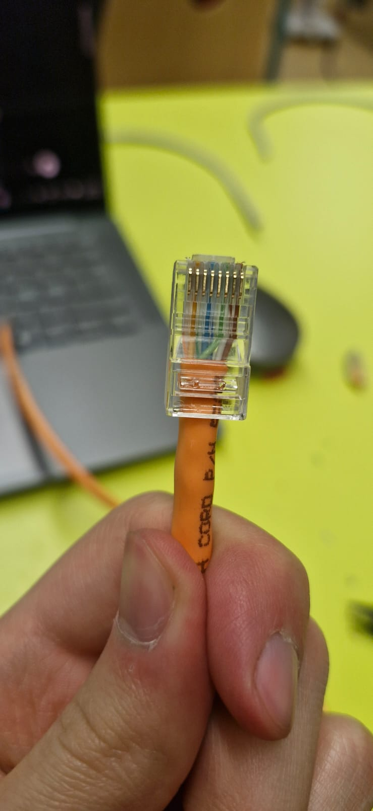
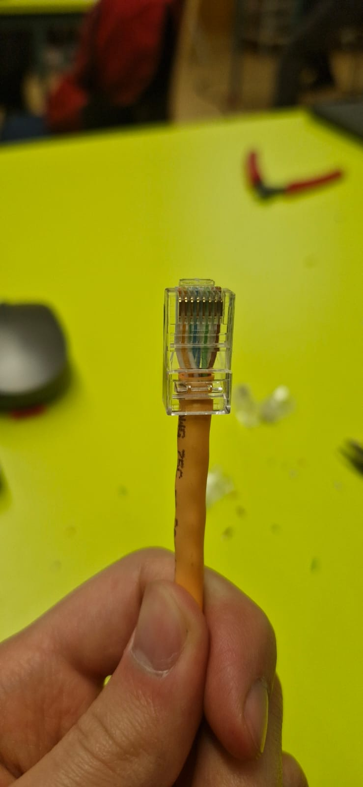
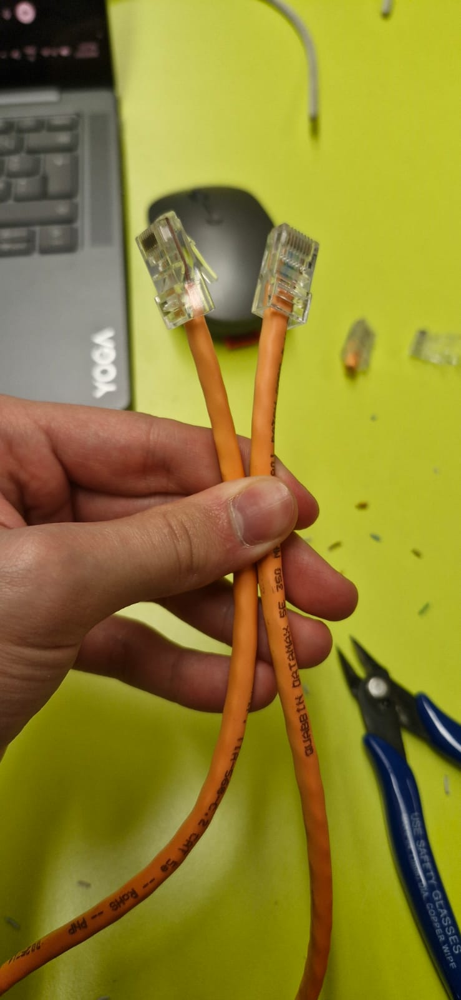
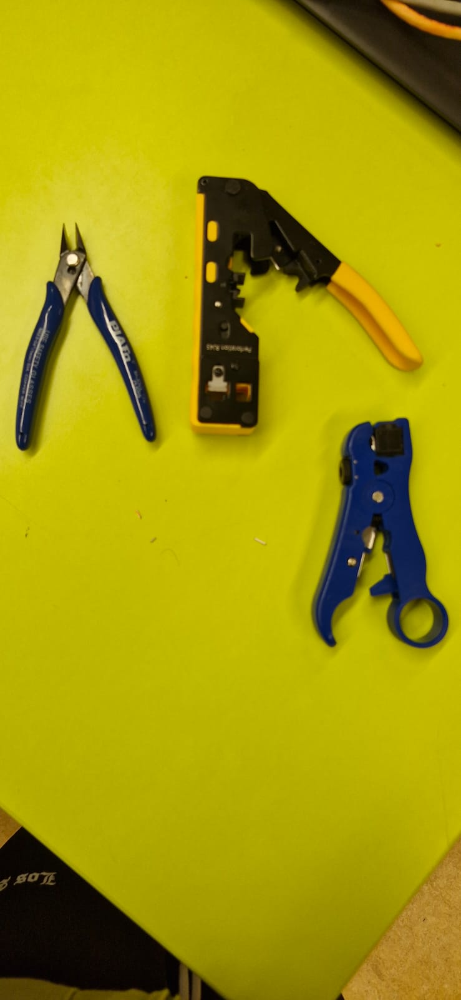
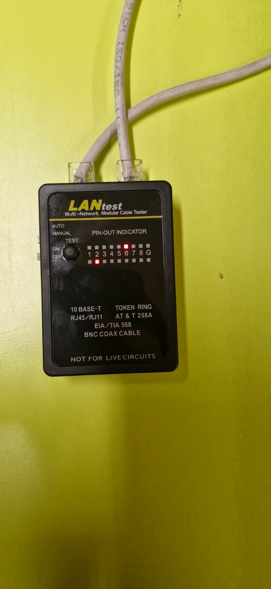
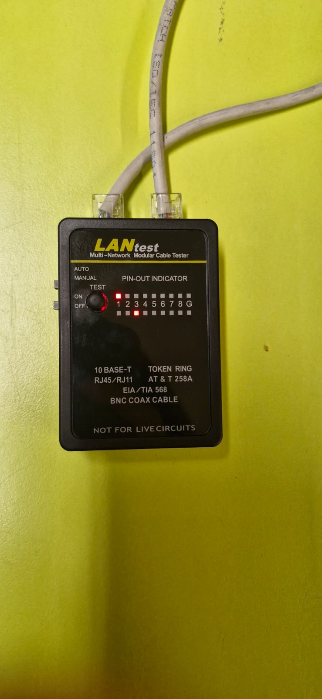
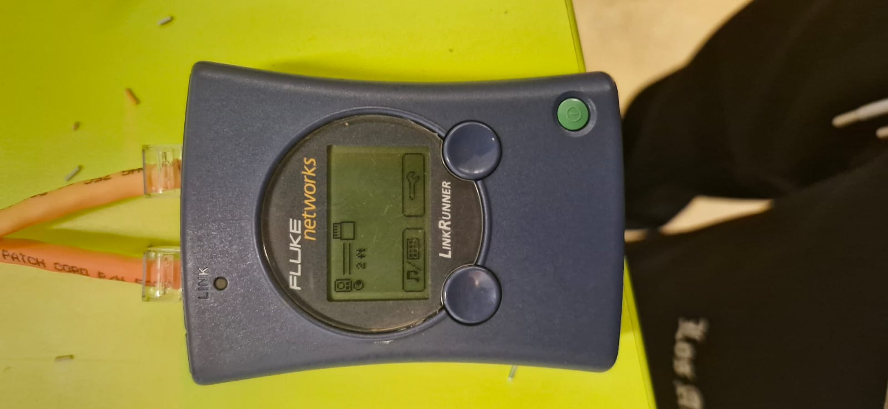

# KEST2V_verk2

# Snúrugerð og skýrsla

## skýrsla 
#### Í dag í skólanum vorum við að búa til ethernet kapall (stuttan 20-30 cm) af B gerð (beint í gegn) og einnig ethernet kapall (stuttan 20-30 cm) af B gerð í A gerð (kross). Kennarinn byrjaði á því að útskýra fyrir okkur hvað við þyrftum að gera. Hann rétti okkur kaplana og RJ-45 hausinn sem átti að tengja þá saman við kapalinn. Ég byrjaði á að gera B útgáfuna fyrst. Það var erfitt í byrjun að raða þeim í rétta röð en mér tókst að gera það rétt. Það voru myndir af fullunnu verki mínu alla leið niður og ég notaði verkfæri eins og klemmubúnað, klippitæki til að klippa vírana og röndunarvél til að setja (verndar)lagið á vírinn. Ég náði að gera bæði rétt og ég vissi að með því að nota vél sem hjálpar til við að athuga hvort vírarnir og tengingin væru rétt og að það virkaði. Svo fór ég yfir í A útgáfuna og við þurftum að blanda B og A saman. og mér tókst að gera það og það endaði á því að virka rétt svo ég athugaði það, tók myndir af öllum verkfærunum sem ég notaði og mynd af því svo það virkaði og það var eiginlega allt og sumt og þannig lærði ég að B útgáfan þarf að hafa ákveðna röð víra sem er 
| Pin | Type A | Type B |
|-----|--------|--------|
| 1 | White-Green | White-Orange |
| 2 | Green | Orange |
| 3 | White-Orange | White-Green |
| 4 | Blue | Blue |
| 5 | White-Blue | White-Blue |
| 6 | Orange | Green |
| 7 | White-Brown | White-Brown |
| 8 | Brown | Brown |

## munurinn á CAT5e og CAT6 ethernetkapli

| Feature | CAT5e | CAT6 |
|--------|-------|------|
| Maximum speed | Up to 1 Gbps | Up to 10 Gbps (short distances) |
| Frequency | 100 MHz | 250 MHz |
| Typical use | Home and school networks | Faster or more demanding networks |
| Cable design | Standard twisted pairs | Better insulation and tighter twisting |
| Interference | More crosstalk compared to CAT6 | Reduced crosstalk and interference |
| Reliability | Good for basic networking | More stable at higher speeds |

### images 
#### Hérna niðri eru sýndar myndir af öllu sem ég notaði og kaplunum mínum og hvernig þær virka
______________________
# Þessi mynd sýnir einn hluta af B-kaplinum eftir að það var búið

# þessi mynd sýnir hinn hluta B-kaplinum  eftir að það er búið

# þetta sýnir að þau tvö eru kláruð

Þetta sýnir restina af verkfærunum sem ég notaði til að klára þetta verkefni

# Þessi mynd sýnir nokkur af verkfærunum sem ég notaði og rj45 tengi

# Þessi mynd sýnir að þau virka en ég notaði nýrra tæki sem reyndar kinkaði og sá hvort tengingin virkaði og það virkaði 2 passar við 6

# Þessi mynd sýnir að þau virka en ég notaði nýrra tæki sem reyndar kinkaði og sá hvort tengingin virkaði og það virkaði 1 passar við 3

# Þessi mynd sýnir að kaplarnir virka og eru alveg í lagi

